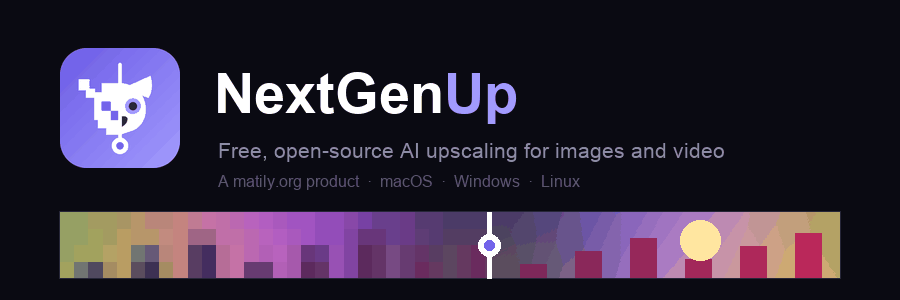

<p align="center">
  
</p>

<p align="center">
  <a href="https://github.com/riponcm/nextgenUp/releases/latest"></a>
  <a href="https://github.com/riponcm/nextgenUp/releases"></a>
  <a href="LICENSE"></a>
  <a href="https://github.com/riponcm/nextgenUp/actions/workflows/desktop.yml"></a>
  <a href="https://github.com/riponcm/nextgenUp/stargazers"></a>
</p>

**NextGenUp** turns low-resolution photos and videos into crisp, high-resolution versions — up to 4K for video and 8K for images — using Real-ESRGAN AI models that run entirely on your own machine. No cloud, no subscription, no watermarks, no upload of your files to anyone's server.

A [matily.org](https://matily.org) product. Free and open source under the MIT license.

---

## Download

| Platform | File | Notes |
|----------|------|-------|
| macOS (Apple Silicon) | [Download .dmg](https://github.com/riponcm/nextgenUp/releases/latest) | M1/M2/M3/M4 Macs |
| macOS (Intel) | [Download .dmg](https://github.com/riponcm/nextgenUp/releases/latest) | x64 build |
| Windows 10/11 (x64) | [Download installer](https://github.com/riponcm/nextgenUp/releases/latest) | NSIS `.exe` or `.msi` |
| Linux (x64) | [Download .AppImage / .deb](https://github.com/riponcm/nextgenUp/releases/latest) | Most distributions |

Every installer is fully self-contained — the AI engine, FFmpeg, and the upscaling models are bundled. Install, open, upscale. The app checks for updates on launch and installs them with one click (signed releases).

macOS note: builds are not notarized with Apple; on first launch, right-click the app and choose Open.

## Features

| | |
|---|---|
| Image upscaling | Four modes — Quick (browser AI), Quality (FFmpeg), Enhance (same size, AI cleanup), Ultra (server AI, works from any device) |
| Video upscaling | Basic (FFmpeg Lanczos + CAS sharpening) and Pro (Real-ESRGAN, frame by frame) |
| Enhance mode | Keep the original resolution but reconstruct detail — noise, blur, and JPEG artifacts removed |
| Face restoration | GFPGAN v1.4 — detected faces are aligned, restored, and seamlessly blended back |
| Batch processing | Drop multiple images, process with any mode, download all as a zip |
| Before/after slider | Drag a divider across the result to compare against the original |
| Cancellable jobs | Every job can be cancelled mid-run; switch modes and restart instantly |
| Portrait and landscape | Orientation handled automatically; output capped at 4K (video) / 8K (image) |
| Auto-updates | Desktop app updates itself from GitHub releases (cryptographically signed) |

## How to use

1. Open NextGenUp and choose **Image Upscale** or **Video Upscale** in the sidebar.
2. Drop a file onto the dropzone (or click to browse — select several images for batch mode).
3. Pick a mode:

   | Mode | Best for |
   |------|----------|
   | Quick | Fast AI upscaling in your browser or the app window |
   | Quality | Sharp non-AI upscaling on the server, very fast |
   | Enhance | Same-size cleanup — "keep it 500x500 but make it crystal clear" |
   | Ultra | Highest-quality AI on the server; also the mode for phones and browsers without WebGPU |

4. Choose the scale factor (2x or 4x), then press **Start Upscaling**.
5. Watch the live progress (cancel any time), compare the result with the before/after slider, and download.

For portraits, tick **Restore faces** in Ultra mode to run GFPGAN face restoration on every detected face.

## Run from source (web app)

The same interface also runs as a self-hosted web app that any device on your network can use.

Requirements: Python 3.10–3.13 and FFmpeg (`brew install ffmpeg` / `apt install ffmpeg`).

```bash
git clone https://github.com/riponcm/nextgenUp.git
cd nextgenUp
./setup.sh
source venv/bin/activate
python app.py
```

Open http://localhost:5000, or `http://<your-ip>:5000` from other devices. Browser AI modes need WebGPU (Chrome/Edge 113+) on secure origins; the Ultra mode works from any browser on any device.

## How it works

```
Browser / app window                 Local server
--------------------                 ------------
upload image or video  ───────────►  Pillow / ffprobe read metadata

Quality & Basic modes  ───────────►  FFmpeg: Lanczos scale + CAS + unsharp

Quick / Enhance / Pro
  ONNX Runtime Web (WebGPU/WASM)
  Real-ESRGAN in a Web Worker
  tile-based inference               Ultra mode
  frames sent back      ───────────►  Real-ESRGAN via ONNX Runtime (CPU)
                                      GFPGAN face restoration
                                      FFmpeg assembles video + audio
```

The AI model is [Real-ESRGAN](https://github.com/xinntao/Real-ESRGAN) (`realesr-general-x4v3`, ~5 MB ONNX). Images are processed in overlapping tiles so any resolution fits in memory; inference runs in a Web Worker (browser) or a background thread (server) so the interface never freezes. Completed tasks persist in SQLite, and files older than 24 hours are cleaned up automatically.

## Configuration

| Environment variable | Default | Purpose |
|----------------------|---------|---------|
| `PORT` | `5000` | Server port |
| `CLEANUP_HOURS` | `24` | Files older than this are deleted |
| `FLASK_DEBUG` | `0` | Set to `1` for the Werkzeug debugger (never on an exposed host) |

Upload limit is 2 GB. Face restoration requires the GFPGAN model (~340 MB): answer yes in `setup.sh`, or for the desktop app drop `GFPGANv1.4.onnx` into the app-data `models/` folder.

## Project layout

```
app.py                     Flask server: upload, upscale, progress, download
ai_engine.py               Server-side Real-ESRGAN (ONNX Runtime, tiled)
face_restore.py            GFPGAN face restoration + YuNet detection
paths.py                   Dev vs. packaged path resolution
templates/index.html       Dashboard (Image Upscale / Video Upscale)
static/js/app.js           Video controller, navigation, About dialog
static/js/image-app.js     Image controller: modes, batch, compare slider
static/js/pro-worker.js    ONNX inference worker (tiling, WebGPU/WASM)
src-tauri/                 Desktop shell (Tauri 2): sidecar, auto-updater
nextgenup-server.spec      PyInstaller build for the bundled server
.github/workflows/         CI: signed installers for all platforms
```

## Building and releasing the desktop app

Releases are built by GitHub Actions. Bump the version in `src-tauri/tauri.conf.json` and `app.py`, then:

```bash
git tag v1.0.1
git push origin v1.0.1
```

Installers for macOS (Intel and Apple Silicon), Windows x64, and Linux are compiled, signed for auto-update, and attached to the GitHub release automatically. Existing installations pick the update up on next launch.

## Roadmap

- Larger server models (Real-ESRGAN x4plus, HAT) for a maximum-quality tier
- Face restoration for video frames
- WebCodecs-based frame extraction for faster Pro video
- In-app GFPGAN model download
- Docker image

## Support the project

If NextGenUp is useful to you, please [star the repository](https://github.com/riponcm/nextgenUp) — it is the simplest way to help other people discover a free alternative to paid upscalers. Sharing the project with anyone who works with old photos, AI-generated media, or low-resolution video helps just as much. Issues and pull requests are welcome.

## Acknowledgements

NextGenUp stands on excellent open work:

- [Real-ESRGAN](https://github.com/xinntao/Real-ESRGAN) (Xintao Wang et al.) — super-resolution models
- [GFPGAN](https://github.com/TencentARC/GFPGAN) (Tencent ARC) — face restoration
- [YuNet](https://github.com/opencv/opencv_zoo) (OpenCV Zoo) — face detection
- [FFmpeg](https://ffmpeg.org) — video processing (bundled builds are GPL; FFmpeg keeps its own license)
- [ONNX Runtime](https://onnxruntime.ai) — AI inference on server and in the browser
- [Tauri](https://tauri.app) — desktop shell
- [Flask](https://flask.palletsprojects.com) — local server

Built and maintained by [Matily](https://matily.org), with [projectmem](https://github.com/riponcm/projectmem) providing persistent project memory during development. Claude is a co-contributor to this codebase.

## License

[MIT](LICENSE) © 2026 Ripon Chandra Malo / matily.org
